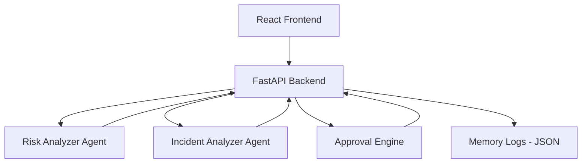

# 🚀 AI SRE Copilot — Production Deployment Risk Engine

An AI-powered Site Reliability Engineering (SRE) Copilot that analyzes deployment risk, detects incidents, and simulates human-in-the-loop approval workflows.

---

# 🧠 Features

- ⚡ Real-time deployment risk scoring
- 🚨 Incident detection engine (production-aware)
- 🧠 Context-aware AI logic (database, payment, production)
- 👨‍💻 Human approval decision system
- 💾 Persistent logs (JSON memory system)
- 📊 React dashboard UI
- 🐳 Docker-ready backend
- 🔌 REST API (FastAPI)

---

# 🏗️ System Architecture

---

# ⚙️ Tech Stack

Backend
- FastAPI
- Python
- Uvicorn

Frontend
- React.js
- JavaScript (ES6+)

Storage
- JSON file-based persistent logging

DevOps (Optional)
- Docker support
- Cloud-ready deployment (Render / AWS / GCP compatible)

---

# 🚀 How to Run the Project

1️⃣ Clone Repository
 - git clone https://github.com/your-username/ai-sre-copilot.git
-  cd ai-sre-copilot

2️⃣ Backend Setup
-  cd backend
- pip install -r requirements.txt
- python -m uvicorn backend.app:app --reload

Backend runs at:

- http://127.0.0.1:8000
- http://127.0.0.1:8000/docs

3️⃣ Frontend Setup
- cd frontend
- npm install
- npm start

Frontend runs at:

- http://localhost:3000

---
🧠 Core Intelligence Logic

The system evaluates deployments using:
- Keyword-based risk scoring
- Incident severity detection engine
- Business-critical system awareness
- Production impact heuristics
- Approval threshold logic
---
💡 Future Enhancements
- ML-based risk prediction model
- PostgreSQL / MongoDB integration
- Slack / Microsoft Teams approval integration
- Kubernetes deployment support
- Prometheus + Grafana monitoring
- JWT authentication system
---

🏆 Project Highlights

- Production-style system design
- Real-world DevOps workflow simulation
- Full-stack AI agent architecture
- Human-in-the-loop decision system
- Audit-ready logging mechanism
---

    🚀 Final Note

    This project demonstrates a production-grade AI SRE Copilot system designed for modern DevOps pipelines, incident prevention, and deployment safety automation.
---
👨‍💻 Author
Muqaddas Saad
---
