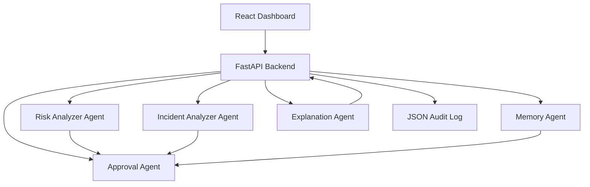

# 🚀 AI SRE Copilot

AI SRE Copilot is a full-stack agentic application for deployment governance. It helps teams review risky production changes before release by combining separate agents for risk analysis, incident detection, approval routing, memory lookup, and explanation generation.

## Why this project is valuable

This project addresses a real operational challenge: production deployments can be risky, especially when they involve databases, payments, or customer-facing systems. Instead of relying only on manual inspection, AI SRE Copilot produces a structured safety review that shows risk, incident severity, and approval guidance.

## Capstone fit

This project fits the Kaggle capstone well because it demonstrates:

- Multi-agent design: distinct agents handle deployment risk assessment, incident analysis, approval decisions, memory, and explanation.
- Security awareness: sensitive values such as passwords, tokens, and API keys are redacted before persistence.
- Deployability: the system runs as a FastAPI backend with a React frontend and can be containerized with Docker.
- Practical business value: it supports safer change management for teams operating critical systems.

## Architecture



## How the agents work

The project is organized around five specialized agent roles:

- RiskAnalyzerAgent: evaluates deployment risk using database/schema changes, production impact, payment dependencies, rollback complexity, and time-window signals.
- IncidentAnalyzerAgent: classifies incident severity using failure signals, production impact, payment/checkout disruption, latency issues, and rollback complexity.
- ApprovalAgent: decides whether a deployment should be auto-approved, manually reviewed, or blocked based on the stronger of risk and incident severity.
- MemoryAgent: stores prior deployment requests and retrieves similar history for context.
- ExplanationAgent: turns the analysis into a concise structured rationale with risk factors, incident signals, and the final decision.

## Key features

- Deployment-risk scoring for change requests
- Incident severity classification
- Approval guidance for production changes
- Memory-based history lookup for similar prior requests
- Structured explanation layer for transparent reasoning
- Structured audit logs for traceability
- Sensitive-data redaction for safety
- Demo-friendly UI with sample scenarios
- Docker-ready deployment path

## Tech stack

- Backend: FastAPI, Python
- Frontend: React, JavaScript
- Storage: JSON-based logs
- Deployment: Docker, Uvicorn

## Local setup
### Backend
```bash
 cd backend
 pip install -r requirements.txt
 python -m uvicorn backend.app:app --reload
```
### Frontend
```bash
cd frontend
npm install
npm start
```

## Security design

The backend sanitizes user input before analysis and logging. This helps prevent accidental leakage of secrets such as passwords, tokens, or API keys.

## Example Input

```text
Deploy a small database schema change to production with rollback support.
```

## Example Output

```json
{
  "risk_score": 35,
  "incident": "MEDIUM INCIDENT",
  "decision": "REVIEW RECOMMENDED"
}
```

## Capstone evidence

This project demonstrates at least three important capstone concepts:

1. Agent / multi-agent system: separate agents for risk and incident reasoning.
2. Security features: redaction of sensitive values before persistence.
3. Deployability: FastAPI + React + Docker workflow.

## Author
Muqaddas Saad

GitHub: https://github.com/Muqaddas1617
---
